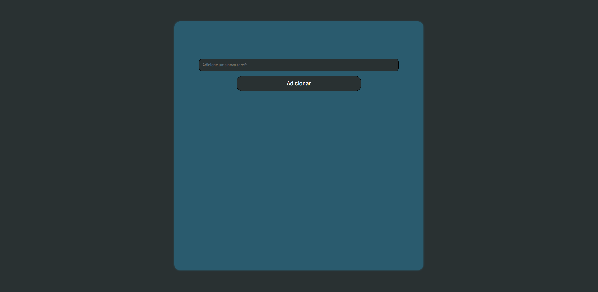

<h1 align="center">📗 Sobre o projeto</h1>


 
 <h3 align="center">
 Para acessar este arquivo digite no prompt:
 </h3>

```git clone https://github.com/igorlimasandes/Tarefa-JS.git```

---

<h2 align="center">🔨 Ferramentas</h2>

As seguintes ferramentas foram usadas na construção do projeto:

- [HTML5](https://developer.mozilla.org/pt-BR/docs/Web/HTML)
- [CSS3](https://developer.mozilla.org/pt-BR/docs/Web/CSS)
- [JavaScript](https://developer.mozilla.org/pt-BR/docs/Web/JavaScript)

---

<h2 align="center">👨‍🎓 Autor</h2>

<h3 align="center">
<a href="https://igorlimasandes.netlify.app">

<br>
Igor Sandes
</a>

<br>
<br>

[](https://www.linkedin.com/in/igorlimasandes/) 
[](mailto:igorlimasandes@gmail.com)
</h3>
